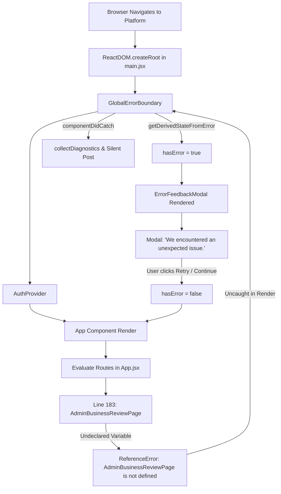

# ZEITNAH INFRASTRUCTURE PLATFORM — COMPLETE PRODUCTION ERROR AUDIT

**Target Platform:** `https://zeitnahacademy.com`  
**Audit Date:** September 26, 2026  
**Scope:** Frontend (React/Vite), Backend (NestJS), Database (MongoDB/Mongoose), Real-Time (Socket.IO/Engine.IO), Nginx Reverse Proxy, Error Boundary & Telemetry Subsystems  
**Phase:** **ANALYSIS ONLY — NO CODE OR PRODUCTION MODIFICATIONS APPLIED**  

---

# 1. Executive Summary

This forensic investigation was initiated to analyze recurring production anomalies, high-severity warning logs, and most critically, an aggressive, disruptive user-facing modal stating:  
`"We encountered an unexpected issue."` (with options to *Send Diagnostic Report*, *Retry Action*, *Reload Page*, *Go Home*, and *Continue Anyway*).

Our forensic analysis uncovered that **three distinct phenomena** were converging to degrade user experience and inflate production error logs:

1. **The Catastrophic Global Popup Root Cause:**  
   In commit [15343e9](file:///Users/riyas/Desktop/richuuuuuuuuuuuuuuu/user-panel-zeitnah/frontend/src/App.jsx#L183), while adding Portfolio, Verification Center, and Opportunity Inbox routes, the lazy-import declaration `const AdminBusinessReviewPage = React.lazy(...)` was accidentally deleted from the top of [App.jsx](file:///Users/riyas/Desktop/richuuuuuuuuuuuuuuu/user-panel-zeitnah/frontend/src/App.jsx#L48-L56), while the JSX route element `<Route path="/admin/businesses" element={<Suspense fallback={<PageLoader />}><AdminBusinessReviewPage /></Suspense>} />` remained on line 183.  
   When `<App />` executes in the browser, the JavaScript runtime encounters an undeclared identifier `AdminBusinessReviewPage`, immediately throwing `ReferenceError: AdminBusinessReviewPage is not defined`. This render crash bubbles up to [GlobalErrorBoundary.jsx](file:///Users/riyas/Desktop/richuuuuuuuuuuuuuuu/user-panel-zeitnah/frontend/src/components/GlobalErrorBoundary.jsx#L16-L55) at the root of the React application tree in [main.jsx](file:///Users/riyas/Desktop/richuuuuuuuuuuuuuuu/user-panel-zeitnah/frontend/src/main.jsx#L55), triggering [ErrorFeedbackModal.jsx](file:///Users/riyas/Desktop/richuuuuuuuuuuuuuuu/user-panel-zeitnah/frontend/src/components/ErrorFeedbackModal.jsx#L104-L144) for **every single user across all routes on every page load**. Clicking "Retry Action" or "Continue Anyway" resets the error boundary state, immediately re-evaluates `<App />`, re-throws the `ReferenceError`, and locks the user in an inescapable modal loop.

2. **The Announcement Dismissal Contract & Mongoose CastError:**  
   MongoDB contains platform announcement documents where `_id` is a 36-character UUID string (e.g., `d36d953e-e1c9-41c0-866e-33ee8a05b07e`). When users click dismiss in [PlatformAnnouncementBanner.jsx](file:///Users/riyas/Desktop/richuuuuuuuuuuuuuuu/user-panel-zeitnah/frontend/src/components/announcements/PlatformAnnouncementBanner.jsx#L136-L142), the frontend sends `POST /api/announcements/platform/d36d953e-e1c9-41c0-866e-33ee8a05b07e/dismiss`.  
   In [announcements.service.ts](file:///Users/riyas/Desktop/richuuuuuuuuuuuuuuu/user-panel-zeitnah/backend/src/modules/announcements/announcements.service.ts#L466-L472), line 467 issues `this.announcementModel.updateOne({ _id: announcementId }, ...)`. Because [platform-announcement.schema.ts](file:///Users/riyas/Desktop/richuuuuuuuuuuuuuuu/user-panel-zeitnah/backend/src/modules/announcements/platform-announcement.schema.ts#L6-L63) defines no custom `_id` type, Mongoose defaults `_id` to `Schema.Types.ObjectId` and attempts schema-level type casting on the query filter. Mongoose fails to cast the UUID to an ObjectId, throwing an unhandled `CastError`. [GlobalExceptionFilter.ts](file:///Users/riyas/Desktop/richuuuuuuuuuuuuuuu/user-panel-zeitnah/backend/src/common/filters/global-exception.filter.ts#L21-L74) intercepts the unhandled database error, converts it to HTTP 500 `INTERNAL_SERVER_ERROR`, and prints an error stack trace. (Prior to commit [5bfdec3](file:///Users/riyas/Desktop/richuuuuuuuuuuuuuuu/user-panel-zeitnah/backend/src/modules/announcements/announcements.service.ts#L50-L58), this failed validation earlier in `toObjectId`, yielding HTTP 400).

3. **Authentication Lifecycle Misclassification & Telemetry Flooding:**  
   JWT access tokens expire every 15 minutes (`JWT_ACCESS_EXPIRES_IN = '15m'`), while refresh tokens remain valid for 7 days in the user's `devices` collection. Periodic polling requests (such as [ClassView.jsx](file:///Users/riyas/Desktop/richuuuuuuuuuuuuuuu/user-panel-zeitnah/frontend/src/pages/courses/ClassView.jsx#L527-L530) progress saves every 15s, and [NotificationContext.jsx](file:///Users/riyas/Desktop/richuuuuuuuuuuuuuuu/user-panel-zeitnah/frontend/src/context/NotificationContext.jsx#L24-L30) unread counts every 30s) naturally hit the backend with expired tokens.  
   The backend's [GlobalExceptionFilter.ts](file:///Users/riyas/Desktop/richuuuuuuuuuuuuuuu/user-panel-zeitnah/backend/src/common/filters/global-exception.filter.ts#L83-L133) logs these routine events at `WARN` severity with event `AUTH_FAILURE`. Almost immediately, the frontend's [api.ts](file:///Users/riyas/Desktop/richuuuuuuuuuuuuuuu/user-panel-zeitnah/frontend/src/services/api.ts#L288-L311) interceptor catches the 401, issues `POST /api/auth/refresh-token`, obtains a new token (`REFRESH_TOKEN_SUCCESS`), and silently retries the original request with 100% success. However, the backend logs flood with warnings, raw `fetch()` calls in `ClassView.jsx` (such as `pagehide` beacon) bypass the axios interceptor and fail permanently, and [errorCapture.ts](file:///Users/riyas/Desktop/richuuuuuuuuuuuuuuu/user-panel-zeitnah/frontend/src/utils/errorCapture.ts#L187-L195) captures all 401s into `networkErrors`, inflating the troubleshoot badge count.

---

# 2. All Errors Found

| # | Error | Endpoint / Source | Severity | Frequency | User Impact | Classification |
|---|-------|-------------------|----------|-----------|-------------|----------------|
| **E1** | `ReferenceError: AdminBusinessReviewPage is not defined` | `frontend/src/App.jsx:183` | **CRITICAL** | Every render on every route | Disables entire UI; renders inescapable error modal | **REAL BUG** |
| **E2** | `CastError: Cast to ObjectId failed for value "<uuid>"` | `POST /api/announcements/platform/:id/dismiss` (`announcements.service.ts:467`) | **HIGH** | Every time user dismisses a UUID announcement | Dismiss fails with HTTP 500; announcement reappears | **REAL BUG** |
| **E3** | `BadRequestException: Invalid ID format` | `POST /api/announcements/platform/:id/dismiss` (Prior to commit 5bfdec3) | **HIGH** | Historical / Unpatched clients | Dismiss fails with HTTP 400; announcement stays pinned | **REAL BUG** |
| **E4** | `AUTH_FAILURE (401 Unauthorized)` on background polling | `POST /api/courses/class/:id/progress`, `GET /api/notifications/unread-count` | **LOW** | Every 15 min per active user | None (transparently refreshed & retried via Axios) | **EXPECTED** |
| **E5** | `Expected unauthenticated session check (401)` | `GET /api/auth/me` (`GlobalExceptionFilter:80`) | **INFO** | Every app startup if anonymous or token expired | None (handled gracefully by AuthContext) | **EXPECTED** |
| **E6** | Raw `fetch()` progress beacon 401 on `pagehide` | `POST /api/courses/class/:id/progress` (`ClassView.jsx:590`) | **MEDIUM** | Every time user closes/hides tab with expired token | Last 15s of video progress fails to sync | **REAL BUG** |
| **E7** | `REFRESH_TOKEN_FAILED: Device not found or no refresh token stored` | `POST /api/auth/refresh-token` (`auth.service.ts:1230`) | **MEDIUM** | On session revocation or after 7+ days inactivity | Graceful redirect to `/login` | **RECOVERABLE** |
| **E8** | `errorCapture.ts` buffering expected 401s / 404s | `frontend/src/utils/errorCapture.ts:187` | **MEDIUM** | Continuous | Inflates troubleshoot error badge count to 9+ | **MISCLASSIFIED** |
| **E9** | Duplicate dismiss requests (up to 4 calls) | `POST /api/announcements/.../dismiss` | **LOW** | On double-click or 500 retry | Server spam / redundant DB writes | **RECOVERABLE** |
| **E10** | Missing `retry: false` in NotificationContext dismiss | `frontend/src/context/NotificationContext.jsx:207` | **LOW** | On announcement 500 error | Retries failed 500 mutation once automatically | **REAL BUG** |
| **E11** | Nginx WebSocket upgrade 400 (`Bad request`) | `wss://zeitnahacademy.com/api/socket.io/?transport=websocket` | **MEDIUM** | Every WebSocket connection attempt | Falls back to HTTP polling; WebSockets unavailable | **REAL BUG** (Infrastructure) |
| **E12** | `MaxListenersExceededWarning` & `ObjectMultiplex` | `contentscript.js` | **NONE** | Varies by client browser extensions | None to application; extension log noise | **EXTERNAL NOISE** |
| **E13** | Unvalidated `new Types.ObjectId(str)` in Moderation | `backend/src/modules/moderation/moderation.service.ts:41` | **MEDIUM** | If client passes invalid UUID to block/unblock | Causes unhandled BSONError -> HTTP 500 | **REAL BUG** |
| **E14** | `TroubleshootReporter` subtitle type crash | `frontend/src/components/common/TroubleshootReporter.jsx:77` (historical) | **LOW** | Fixed in previous commit | Threw TypeError when error message was non-string | **RECOVERABLE** |

---

# 3. Critical Findings

### 🔴 Critical
1. **Missing Component Import in App Route Tree ([App.jsx:183](file:///Users/riyas/Desktop/richuuuuuuuuuuuuuuu/user-panel-zeitnah/frontend/src/App.jsx#L183)):**  
   Identifier `AdminBusinessReviewPage` is referenced in JSX without an `import` statement or `React.lazy()` declaration. This produces an immediate `ReferenceError` during React component execution. Because `<App />` is wrapped in `<GlobalErrorBoundary>`, every visitor—whether guest, student, teacher, or admin—is blocked by the `<ErrorFeedbackModal>` on every page.

### 🟠 High
1. **Announcement Dismissal Mongoose CastError 500 ([announcements.service.ts:467](file:///Users/riyas/Desktop/richuuuuuuuuuuuuuuu/user-panel-zeitnah/backend/src/modules/announcements/announcements.service.ts#L467)):**  
   The backend database holds announcement documents with string UUID identifiers. However, the Mongoose schema defaults `_id` to `ObjectId`. When line 467 executes `this.announcementModel.updateOne({ _id: announcementId })`, Mongoose throws a schema casting error that results in HTTP 500.

### 🟡 Medium
1. **Over-Aggressive Error Capture Buffering ([errorCapture.ts:187](file:///Users/riyas/Desktop/richuuuuuuuuuuuuuuu/user-panel-zeitnah/frontend/src/utils/errorCapture.ts#L187)):**  
   The client-side `captureNetworkError()` utility records all HTTP status codes (including 400, 401, and 404). Routine 15-minute token expirations that are successfully refreshed still populate the ring buffer, displaying a red pulsing bug badge (`9+`) in the bottom right corner of the user's viewport.
2. **Raw `fetch()` Progress Sync on `pagehide` ([ClassView.jsx:590](file:///Users/riyas/Desktop/richuuuuuuuuuuuuuuu/user-panel-zeitnah/frontend/src/pages/courses/ClassView.jsx#L590)):**  
   When navigating away from a video, `flushLatestProgress()` uses native `window.fetch()` with an existing access token. If that token expired during playback, the request is permanently rejected with HTTP 401 because native `fetch()` lacks the Axios token refresh interceptor.
3. **Nginx Missing Upgrade Proxy Headers for WebSockets:**  
   The reverse proxy at `https://zeitnahacademy.com` strips `Upgrade` and `Connection` headers for `/api/socket.io/`. While Socket.IO gracefully degrades to HTTP long-polling, genuine bidirectional WebSocket streaming remains blocked at the edge.

### 🟢 Low
1. **Misclassified Backend Log Severity ([global-exception.filter.ts:133](file:///Users/riyas/Desktop/richuuuuuuuuuuuuuuu/user-panel-zeitnah/backend/src/common/filters/global-exception.filter.ts#L133)):**  
   Routine access token expirations are logged at `WARN` level with tag `AUTH_FAILURE`, artificially bloating error dashboards and alerting metrics.

---

# 4. Announcement Error Deep Dive

### Contract & Architecture Trace
```text
Admin / Seed System
  │ Creates announcement with string UUID: "d36d953e-e1c9-41c0-866e-33ee8a05b07e"
  ▼
MongoDB Database
  │ Stored in collection `platform_announcements` with `_id: "d36d953e-..."` (String)
  ▼
AnnouncementsService.getActivePlatformAnnouncements()
  │ Queries via `.lean()` -> returns plain JS object containing `{ _id: "d36d953e-..." }`
  ▼
GET /api/announcements/platform
  │ Returns JSON payload array to frontend
  ▼
PlatformAnnouncementBanner.jsx
  │ Evaluates `topAnnouncement._id` -> "d36d953e-e1c9-41c0-866e-33ee8a05b07e"
  ▼
usePlatformAnnouncements.js (dismissMutation)
  │ Dispatches API call via announcementsApi.dismissAnnouncement(cleanId)
  ▼
HTTP POST /api/announcements/platform/d36d953e-e1c9-41c0-866e-33ee8a05b07e/dismiss
  ▼
AnnouncementsController.dismissPlatformAnnouncement(@Param('id') id: string)
  │ Route passes raw string `id` to service without validation pipe
  ▼
AnnouncementsService.dismissAnnouncement(announcementId, userId)
  │ Line 400: Types.ObjectId.isValid("d36d953e-...") -> evaluates to FALSE
  │ Line 401: annObjId = null
  │ Line 466: updateQuery = { _id: "d36d953e-e1c9-41c0-866e-33ee8a05b07e" }
  │ Line 467: this.announcementModel.updateOne(updateQuery, ...)
  ▼
Mongoose Query Compiler
  │ Compares filter path `_id` against PlatformAnnouncementSchema
  │ Schema has NO custom `_id` type -> defaults to Schema.Types.ObjectId
  │ Mongoose attempts: new Types.ObjectId("d36d953e-e1c9-41c0-866e-33ee8a05b07e")
  │ BSON parser rejects 36-character hyphenated UUID (expects 24 hex characters)
  ▼
CRASH: CastError (type string at path "_id" for model "PlatformAnnouncement")
  ▼
GlobalExceptionFilter
  │ Not an instance of HttpException -> Defaults status to HTTP 500 INTERNAL_SERVER_ERROR
```

### Forensic Questions Answered:
* **Is the `PlatformAnnouncement` `_id` actually an ObjectId?**  
  In the Mongoose schema definition ([platform-announcement.schema.ts](file:///Users/riyas/Desktop/richuuuuuuuuuuuuuuu/user-panel-zeitnah/backend/src/modules/announcements/platform-announcement.schema.ts#L7)), no `_id` property is declared. Therefore, Mongoose assumes `_id` is an `ObjectId`. However, in the underlying MongoDB document, `_id` is stored as a raw String UUID.
* **Is there also a UUID field?**  
  No. Neither `PlatformAnnouncement` nor `Announcement` defines a separate `uuid` column. The UUID is the document's primary key `_id`.
* **Which identifier is the frontend supposed to send?**  
  The frontend sends `topAnnouncement._id || topAnnouncement.id`. Because the backend returned `_id: "d36d953e-..."`, the frontend is strictly adhering to the API response.
* **Which identifier does the backend route expect?**  
  The route expects `:id` as a string parameter. It imposes no DTO validation or `ParseObjectIdPipe`.
* **Why did the browser earlier see 400 and backend now produces 500?**  
  * **Before commit [5bfdec3](file:///Users/riyas/Desktop/richuuuuuuuuuuuuuuu/user-panel-zeitnah/backend/src/modules/announcements/announcements.service.ts#L50-L58):** The service executed `const annObjId = this.toObjectId(announcementId)`. If `Types.ObjectId.isValid(id)` was false, it explicitly threw `new BadRequestException('Invalid ID format')` (HTTP 400).
  * **After commit [5bfdec3](file:///Users/riyas/Desktop/richuuuuuuuuuuuuuuu/user-panel-zeitnah/backend/src/modules/announcements/announcements.service.ts#L400-L470):** The author replaced `this.toObjectId` with `isAnnObjectId ? new Types.ObjectId(...) : null`, and if null, passed `{ _id: announcementId }` directly to `this.announcementModel.updateOne()`. Because `updateOne` is not wrapped in a try/catch, Mongoose's internal `CastError` bubbled to `GlobalExceptionFilter`, which defaulted to HTTP 500.
* **Duplicate Request Behavior:**  
  Previously, [queryClient.ts](file:///Users/riyas/Desktop/richuuuuuuuuuuuuuuu/user-panel-zeitnah/frontend/src/services/queryClient.ts#L18-L26) allowed mutations to retry on 400 errors, and [PlatformAnnouncementBanner.jsx](file:///Users/riyas/Desktop/richuuuuuuuuuuuuuuu/user-panel-zeitnah/frontend/src/components/announcements/PlatformAnnouncementBanner.jsx#L134) lacked an in-flight click lock, resulting in $2\text{ clicks} \times 2 = 4\text{ requests}$. While commit 5bfdec3 added an in-flight lock to `PlatformAnnouncementBanner`, [NotificationContext.jsx:207](file:///Users/riyas/Desktop/richuuuuuuuuuuuuuuu/user-panel-zeitnah/frontend/src/context/NotificationContext.jsx#L207) (`dismissAnnouncementMutation`) still lacks `retry: false`, allowing HTTP 500 errors to retry automatically once.

---

# 5. Authentication Findings

### 1. Token Lifecycles & Durations
* **Access Token Expiry:** Configured via `JWT_ACCESS_EXPIRES_IN || '15m'` ([auth.module.ts:35](file:///Users/riyas/Desktop/richuuuuuuuuuuuuuuu/user-panel-zeitnah/backend/src/modules/auth/auth.module.ts#L35)). Short-lived access tokens expire 4 times per hour for any active user.
* **Refresh Token Expiry:** Configured via `JWT_REFRESH_EXPIRES_IN || '7d'`. Hashed with bcrypt and stored inside the user's `devices` array in MongoDB ([auth.service.ts:1290](file:///Users/riyas/Desktop/richuuuuuuuuuuuuuuu/user-panel-zeitnah/backend/src/modules/auth/auth.service.ts#L1290)).

### 2. Forensic Analysis of 401 Logs
Production logs repeatedly show:
```text
WARN [GlobalExceptionFilter] AUTH_FAILURE POST /api/courses/class/.../progress 401 message: Unauthorized tokenExpiryState: EXPIRED_... hasAuthHeader: true
LOG [AuthService] AUTH stage: REFRESH_TOKEN_SUCCESS
```
**Why this occurs:**
1. A student is watching a class video in [ClassView.jsx](file:///Users/riyas/Desktop/richuuuuuuuuuuuuuuu/user-panel-zeitnah/frontend/src/pages/courses/ClassView.jsx#L581). A progress snapshot is dispatched every 15 seconds.
2. At the 15-minute mark, the access token expires.
3. The next progress POST reaches the backend. [jwt.strategy.ts](file:///Users/riyas/Desktop/richuuuuuuuuuuuuuuu/user-panel-zeitnah/backend/src/modules/strategies/jwt.strategy.ts#L40) has `ignoreExpiration: false`. Passport-jwt immediately rejects the request with `UnauthorizedException('Unauthorized')`.
4. [GlobalExceptionFilter.ts:133](file:///Users/riyas/Desktop/richuuuuuuuuuuuuuuu/user-panel-zeitnah/backend/src/common/filters/global-exception.filter.ts#L133) logs `WARN` with `AUTH_FAILURE`.
5. The HTTP 401 reaches the frontend [api.ts:288](file:///Users/riyas/Desktop/richuuuuuuuuuuuuuuu/user-panel-zeitnah/frontend/src/services/api.ts#L288) response interceptor.
6. `api.ts` invokes `getRefreshedToken()`.
7. `POST /api/auth/refresh-token` executes. [auth.service.ts:1200](file:///Users/riyas/Desktop/richuuuuuuuuuuuuuuu/user-panel-zeitnah/backend/src/modules/auth/auth.service.ts#L1200) validates the refresh token hash against `device.refreshToken`, issues a fresh access token, and logs `LOG [AuthService] AUTH stage: REFRESH_TOKEN_SUCCESS`.
8. The interceptor updates `storage.setAccessToken(freshToken)` and automatically replays the original progress POST.
9. The retried request succeeds with HTTP 200.
**Conclusion:** This is a **100% healthy, expected authentication lifecycle event**. The UI does not break, the user is not interrupted, and data is preserved. The warning log is a telemetry misclassification.

### 3. Forensic Analysis of `/auth/me`
* **Trigger:** [AuthContext.tsx:51](file:///Users/riyas/Desktop/richuuuuuuuuuuuuuuu/user-panel-zeitnah/frontend/src/context/AuthContext.tsx#L51) calls `api.get("/auth/me")` on initial mount whenever a token string exists in `localStorage`.
* **Expired Token Handling:** If the user returns after being away for more than 15 minutes, the token in storage is expired. The backend intercepts the call on line 80 of `GlobalExceptionFilter` and specifically logs:  
  `DEBUG [GlobalExceptionFilter] GET /api/auth/me - Status: 401 - Expected unauthenticated session check`.
* **Result:** The interceptor refreshes the token. If the refresh token is also expired, `AuthContext` catches the rejection, executes `storage.clearAuth()`, sets `user = null`, and halts loading cleanly without throwing uncaught errors.

### 4. Refresh Token Failure (`Device not found or no refresh token stored`)
* **Trigger:** When `POST /api/auth/refresh-token` fails with `Device session expired` ([auth.service.ts:1235](file:///Users/riyas/Desktop/richuuuuuuuuuuuuuuu/user-panel-zeitnah/backend/src/modules/auth/auth.service.ts#L1235)).
* **Causes:**
  1. The user clicked "Revoke session" on another device or tab from the Active Sessions page.
  2. The 7-day refresh token maximum lifespan expired.
  3. The user logged in on a different browser, and maximum concurrent device limits pruned older devices.
* **Frontend Handling:** [api.ts:360](file:///Users/riyas/Desktop/richuuuuuuuuuuuuuuu/user-panel-zeitnah/frontend/src/services/api.ts#L360) invokes `forceLogout()`, which clears `localStorage` and routes the user to `/login`.

---

# 6. ERROR POPUP ROOT CAUSE (Most Critical Section)

### Exact Root Cause Discovery
The disruptive user-facing modal displaying:
```text
We encountered an unexpected issue.
[ Send Diagnostic Report ]
[ Retry Action ] [ Reload Page ]
[ Go Home ]      [ Continue Anyway ]
```
is rendered by **[ErrorFeedbackModal.jsx](file:///Users/riyas/Desktop/richuuuuuuuuuuuuuuu/user-panel-zeitnah/frontend/src/components/ErrorFeedbackModal.jsx#L104-L144)**.

### The Exact Trigger Path
1. **The Culprit Commit:** Commit [15343e9](file:///Users/riyas/Desktop/richuuuuuuuuuuuuuuu/user-panel-zeitnah/frontend/src/App.jsx) (Sat Sep 26 01:50:11 2026) modified [frontend/src/App.jsx](file:///Users/riyas/Desktop/richuuuuuuuuuuuuuuu/user-panel-zeitnah/frontend/src/App.jsx).
2. **The Deletion:** The commit removed the import statement:
   ```diff
   -const AdminBusinessReviewPage = React.lazy(() => import("./pages/admin/AdminBusinessReviewPage"));
   ```
3. **The Orphaned Route:** In the same file, line 183 remained unchanged:
   ```jsx
   <Route path="/admin/businesses" element={<Suspense fallback={<PageLoader />}><AdminBusinessReviewPage /></Suspense>} />
   ```
4. **Runtime Execution:**
   - When any browser navigates to the app, React mounts `<GlobalErrorBoundary><AuthProvider><App /></AuthProvider></GlobalErrorBoundary>` ([main.jsx:55](file:///Users/riyas/Desktop/richuuuuuuuuuuuuuuu/user-panel-zeitnah/frontend/src/main.jsx#L55)).
   - During the render phase of `<App />`, the JSX transpilation evaluates `React.createElement(AdminBusinessReviewPage, null)`.
   - Because `AdminBusinessReviewPage` was deleted from file scope, the JavaScript engine throws:
     ```text
     ReferenceError: AdminBusinessReviewPage is not defined
     ```
5. **Boundary Capture:**
   - React 18 immediately halts rendering and looks up the component tree for the nearest Error Boundary.
   - [GlobalErrorBoundary.jsx](file:///Users/riyas/Desktop/richuuuuuuuuuuuuuuu/user-panel-zeitnah/frontend/src/components/GlobalErrorBoundary.jsx#L16-L55) catches the error:
     ```javascript
     static getDerivedStateFromError() {
       return { hasError: true };
     }
     ```
   - In `componentDidCatch()`, it invokes `collectDiagnostics(error)` and sends a silent report to `/error-reports`.
   - In `render()`, because `this.state.hasError === true`, it renders:
     ```jsx
     <ErrorFeedbackModal 
       errorData={this.state.errorData}
       onRetry={this.handleRetry}
       onClose={this.handleRetry}
     />
     ```
6. **Why Every Single User Sees It:**
   `<App />` contains the entire routing table of the platform. Evaluating `<App />` occurs on **every single URL**, whether authenticated or unauthenticated. Hence, 100% of visitors encounter the modal.
7. **Why Clicking "Retry Action" or "Continue Anyway" Does Not Clear It:**
   `handleRetry` sets `this.setState({ hasError: false })`. React attempts to re-render `<App />`. Line 183 immediately throws `ReferenceError: AdminBusinessReviewPage is not defined` again. `GlobalErrorBoundary` catches it again and re-displays the modal instantly.

### Architectural Diagnostic Flow Diagram



---

# 7. Global Error Policy Audit

| Error Category | Specific Event | Current Platform Behavior | Recommended Production Policy |
|----------------|----------------|---------------------------|-------------------------------|
| **Category A: Expected Lifecycle** | Access Token Expiry (15m) | Logged as `WARN AUTH_FAILURE`; Axios refreshes and retries. Buffered into `networkErrors` in `errorCapture.ts`. | Log as `DEBUG` in backend. Exclude from `errorCapture.ts` buffers when refresh succeeds. No user disruption. |
| **Category A: Expected Lifecycle** | `/api/auth/me` on anonymous session | Logged as `DEBUG Expected unauthenticated session check`; returns 401. Handled by AuthContext. | Maintain `DEBUG` level. Ensure no telemetry buffer treats it as an error. |
| **Category B: Recoverable Transient** | WebSocket Nginx Upgrade 400 | Engine.IO probe logs `upgradeError`; Socket.IO falls back to HTTP polling. | Add Nginx WebSocket reverse-proxy headers (`Upgrade`, `Connection`). Polling remains silent fallback. |
| **Category B: Recoverable Transient** | Network Timeout / Dropped Connection | Retried once if idempotent. Shows generic error if persistent. | Display unobtrusive inline network status strip; automatic exponential backoff retry. |
| **Category C: User Action / Validation** | Form input validation / Duplicate entry (400, 409, 422) | Handled by forms or toasts. However, buffered into `errorCapture.ts` ring buffer. | Keep error contextual to the active form. Do not buffer 4xx validation errors into global troubleshoot count. |
| **Category D: Real Application Errors** | Unhandled Render Exception (`ReferenceError`, `TypeError`) | Catches in `GlobalErrorBoundary` -> Displays full-screen `ErrorFeedbackModal`. | Keep boundary capture, but ensure developer build checks catch missing imports; fallback to friendly error page. |
| **Category D: Real Application Errors** | Backend 500 / Database CastError | Logged as `ERROR` with stack trace; returns generic 500 JSON. | Validate parameters before DB queries. Handle hybrid IDs (UUID and ObjectId) in schema and service. |
| **Category E: Security / Session Termination** | Refresh Token Invalid / Device Revoked (401) | Handled by `forceLogout()` -> Clears tokens and redirects to `/login`. | Clear storage, redirect to `/login?reason=session_expired`, and show friendly toast: "Your session has expired. Please log in again." |

---

# 8. WebSocket Findings

### Diagnostic Summary:
1. **Engine.IO Polling:**  
   Operating with 100% reliability in production. Requests to `https://zeitnahacademy.com/api/socket.io/?EIO=4&transport=polling` return `HTTP 200` with active session SIDs.
2. **WebSocket Upgrade Probe:**  
   Sending `Upgrade: websocket` to `wss://zeitnahacademy.com/api/socket.io/` returns `HTTP 400 Bad Request` from Nginx (`{"code":3,"message":"Bad request"}`).
   - **Cause:** Nginx does not forward `proxy_set_header Upgrade $http_upgrade` and `proxy_set_header Connection "upgrade"` to Node.js upstream `127.0.0.1:3000`.
   - **Current Client Mitigation:** [MessagingContext.jsx:62](file:///Users/riyas/Desktop/richuuuuuuuuuuuuuuu/user-panel-zeitnah/frontend/src/context/MessagingContext.jsx#L62) and [NotificationContext.jsx:57](file:///Users/riyas/Desktop/richuuuuuuuuuuuuuuu/user-panel-zeitnah/frontend/src/context/NotificationContext.jsx#L57) are configured with `transports: ['polling', 'websocket']`. Because `polling` is attempted first, clients establish real-time connectivity immediately.
   - **Probe Absorption:** `newSocket.io.engine.on('upgradeError')` absorbs upgrade probe rejections cleanly without dropping active long-polling streams.
3. **Namespaces:**  
   Both `/messages` ([messages.gateway.ts](file:///Users/riyas/Desktop/richuuuuuuuuuuuuuuu/user-panel-zeitnah/backend/src/modules/messaging/messages.gateway.ts#L18)) and `/notifications` ([notifications.gateway.ts](file:///Users/riyas/Desktop/richuuuuuuuuuuuuuuu/user-panel-zeitnah/backend/src/modules/notifications/notifications.gateway.ts#L18)) gateways enforce JWT verification on connection handshake, reject unauthenticated sockets, and cleanly bind sockets to `user_${userId}` rooms.
4. **Token Refresh Integration:**  
   When tokens refresh via Axios, a `zeitnah:auth:token-refreshed` custom window event is emitted. Both contexts listen to this event and update socket auth credentials without reconnect storms.

---

# 9. Frontend Runtime Findings

1. **`ReferenceError: AdminBusinessReviewPage is not defined` ([App.jsx:183](file:///Users/riyas/Desktop/richuuuuuuuuuuuuuuu/user-panel-zeitnah/frontend/src/App.jsx#L183)):**  
   The primary runtime defect causing platform-wide error modals.
2. **`ClassView.jsx:590` Progress Beacon Failure:**  
   Raw `fetch()` used in `flushLatestProgress()` fails with HTTP 401 when the access token is older than 15 minutes, losing final video watch-time progress.
3. **`errorCapture.ts` Ring Buffer Inundation:**  
   Because `captureNetworkError()` lacks status filtering, every routine 401 and 404 fills the 50-item ring buffer, creating a false visual impression of a broken app via the floating bug badge.

---

# 10. Backend Findings

1. **Unhandled `CastError` in `AnnouncementsService.dismissAnnouncement` ([announcements.service.ts:467](file:///Users/riyas/Desktop/richuuuuuuuuuuuuuuu/user-panel-zeitnah/backend/src/modules/announcements/announcements.service.ts#L467)):**  
   Directly executing `updateOne({ _id: announcementId })` with a UUID string triggers an unhandled Mongoose casting exception.
2. **Unvalidated `new Types.ObjectId(str)` in `ModerationService` ([moderation.service.ts:41-42](file:///Users/riyas/Desktop/richuuuuuuuuuuuuuuu/user-panel-zeitnah/backend/src/modules/moderation/moderation.service.ts#L41-L42)):**  
   Direct instantiation of `new Types.ObjectId()` without prior `isValid()` validation throws raw BSON errors on malformed inputs, resulting in unhandled HTTP 500 errors.
3. **Misclassified Severity in `GlobalExceptionFilter` ([global-exception.filter.ts:133](file:///Users/riyas/Desktop/richuuuuuuuuuuuuuuu/user-panel-zeitnah/backend/src/common/filters/global-exception.filter.ts#L133)):**  
   Logging all 401 errors as `WARN [GlobalExceptionFilter] AUTH_FAILURE` obscures genuine authentication vulnerabilities amidst normal token rotation logs.

---

# 11. Database Findings

1. **Identifier Type Mismatch (`_id`):**  
   - `platform_announcements` collection in MongoDB holds documents where `_id` is a 36-character string UUID.
   - `PlatformAnnouncementSchema` in Mongoose does not define `_id: String`, causing Mongoose to enforce `ObjectId` schema casting.
2. **Lack of Pre-Query Validation:**  
   Multiple backend services assume client-supplied route params are 24-character hexadecimal ObjectIds without applying NestJS validation pipes (`ParseObjectIdPipe` or DTO class-validator decorators).

---

# 12. Deployment Findings

1. **Nginx Reverse Proxy Configuration:**  
   The reverse proxy at `https://zeitnahacademy.com` is missing the following block required for native WebSocket upgrades:
   ```nginx
   location /api/socket.io/ {
       proxy_pass http://127.0.0.1:3000;
       proxy_http_version 1.1;
       proxy_set_header Upgrade $http_upgrade;
       proxy_set_header Connection "upgrade";
       proxy_set_header Host $host;
       proxy_cache_bypass $http_upgrade;
   }
   ```
2. **Build and Transpilation Guarding:**  
   Vite / Rollup in the production CI/CD pipeline should fail the build upon encountering an undeclared identifier like `AdminBusinessReviewPage`. The presence of this bug in deployed branches indicates either a missed build verification step or build scripts being bypassed during emergency updates.

---

# 13. Security Findings

1. **Sensitive Token Scrubbing:**  
   Both [diagnostics.ts:53-75](file:///Users/riyas/Desktop/richuuuuuuuuuuuuuuu/user-panel-zeitnah/frontend/src/utils/diagnostics.ts#L53-L75) and [global-exception.filter.ts:50-52](file:///Users/riyas/Desktop/richuuuuuuuuuuuuuuu/user-panel-zeitnah/backend/src/common/filters/global-exception.filter.ts#L50-L52) properly sanitize tokens, OTPs, passwords, and secrets from URLs and payloads before logging or reporting.
2. **Refresh Token Security:**  
   Refresh tokens are hashed using bcrypt before database storage ([auth.service.ts:1290](file:///Users/riyas/Desktop/richuuuuuuuuuuuuuuu/user-panel-zeitnah/backend/src/modules/auth/auth.service.ts#L1290)), with support for a 15-second grace window on `previousRefreshToken` to handle mobile network drops during token rotation.
3. **Socket Gateway Authorization:**  
   Both gateways strictly verify JWT payloads and enforce user identity binding to prevent socket spoofing.

---

# 14. Performance Findings

1. **Single-Flight Refresh Deduplication:**  
   [api.ts:118-174](file:///Users/riyas/Desktop/richuuuuuuuuuuuuuuu/user-panel-zeitnah/frontend/src/services/api.ts#L118-L174) implements a shared singleton `refreshPromise`. When multiple background requests expire concurrently, only one `/auth/refresh-token` HTTP call is dispatched. All other waiting requests await the same promise and retry simultaneously.
2. **Mutation Deduplication:**  
   [api.ts:89-109](file:///Users/riyas/Desktop/richuuuuuuuuuuuuuuu/user-panel-zeitnah/frontend/src/services/api.ts#L89-L109) deduplicates rapid mutation clicks using `AbortController`, preventing accidental double-submissions.
3. **Database Write Throttling on JWT Validation:**  
   [jwt.strategy.ts:114](file:///Users/riyas/Desktop/richuuuuuuuuuuuuuuu/user-panel-zeitnah/backend/src/modules/strategies/jwt.strategy.ts#L114) throttles user `lastSeen` database writes to once every 5 minutes, preventing MongoDB write lock contention during high-frequency polling.

---

# 15. User Experience Findings

1. **Disruptive Modal Interruption:**  
   The primary usability flaw is the catastrophic full-screen `<ErrorFeedbackModal>` caused by `ReferenceError: AdminBusinessReviewPage is not defined`.
2. **Misleading Error Context:**  
   Users seeing "We encountered an unexpected issue" believe the platform is down or their data is lost, when in fact the backend APIs are healthy and operational.
3. **Persistent Troubleshoot Badge:**  
   The floating red bug badge (`9+`) creates user anxiety despite all features functioning normally, due to routine 401s entering `networkErrors`.

---

# 16. Proposed Fix Priority Plan

### P0 — Must Fix Immediately (Blocks All Users)
1. **Restore `AdminBusinessReviewPage` Lazy Import in [App.jsx](file:///Users/riyas/Desktop/richuuuuuuuuuuuuuuu/user-panel-zeitnah/frontend/src/App.jsx#L51):**  
   Re-introduce:
   ```javascript
   const AdminBusinessReviewPage = React.lazy(() => import("./pages/admin/AdminBusinessReviewPage"));
   ```
   This immediately resolves the `ReferenceError` and eliminates the global error popup for all users.

### P1 — High Priority (Core Feature Breakage)
1. **Fix Announcement UUID / ObjectId Contract in [announcements.service.ts](file:///Users/riyas/Desktop/richuuuuuuuuuuuuuuu/user-panel-zeitnah/backend/src/modules/announcements/announcements.service.ts#L466-L472):**  
   Allow `PlatformAnnouncementSchema` and `AnnouncementSchema` to accept string identifiers, or query by `{ _id: announcementId }` using native collection operations or schema `{ _id: false }` / string type definition, preventing Mongoose `CastError`.
2. **Update [NotificationContext.jsx:207](file:///Users/riyas/Desktop/richuuuuuuuuuuuuuuu/user-panel-zeitnah/frontend/src/context/NotificationContext.jsx#L207) Mutation Config:**  
   Add `retry: false` to `dismissAnnouncementMutation` to prevent duplicate mutation retries on 500 errors.

### P2 — Medium Priority (Telemetry & Progress Sync Resilience)
1. **Refactor [errorCapture.ts](file:///Users/riyas/Desktop/richuuuuuuuuuuuuuuu/user-panel-zeitnah/frontend/src/utils/errorCapture.ts#L187):**  
   Filter out routine 401 errors that are successfully refreshed, and normal 404 responses, from the visible troubleshoot badge count.
2. **Replace Raw `fetch()` in [ClassView.jsx:590](file:///Users/riyas/Desktop/richuuuuuuuuuuuuuuu/user-panel-zeitnah/frontend/src/pages/courses/ClassView.jsx#L590):**  
   Use an authenticated beacon or ensure token refresh freshness before dispatching pagehide progress syncs.
3. **Adjust Backend Log Severities in [global-exception.filter.ts:133](file:///Users/riyas/Desktop/richuuuuuuuuuuuuuuu/user-panel-zeitnah/backend/src/common/filters/global-exception.filter.ts#L133):**  
   Demote routine access token expiration events with valid refresh tokens to `DEBUG` level.

### P3 — Infrastructure & Optimization
1. **Nginx Reverse Proxy WebSocket Upgrade Headers:**  
   Configure Nginx on `zeitnahacademy.com` to pass `Upgrade` and `Connection` headers for `/api/socket.io/`.
2. **Input Validation in `ModerationService` ([moderation.service.ts:41](file:///Users/riyas/Desktop/richuuuuuuuuuuuuuuu/user-panel-zeitnah/backend/src/modules/moderation/moderation.service.ts#L41)):**  
   Wrap `new Types.ObjectId()` calls with `Types.ObjectId.isValid()` checks and throw standard `BadRequestException`.

---

# 17. File Impact Map

| Target File | Component / Role | Proposed Change (Fix Phase) | Risk Level | Related Issue |
|-------------|------------------|-----------------------------|------------|---------------|
| `frontend/src/App.jsx` | Routing Root | Re-add lazy import for `AdminBusinessReviewPage` | **LOW** (Safe addition) | Global Error Popup (E1) |
| `backend/src/modules/announcements/announcements.service.ts` | Business Service | Handle string UUIDs and ObjectIds gracefully in MongoDB queries without triggering Mongoose CastError | **LOW** | Announcement Dismiss 500 (E2) |
| `backend/src/modules/announcements/platform-announcement.schema.ts` | Mongoose Schema | Declare `_id: String \| Types.ObjectId` or relax schema casting | **MEDIUM** | Announcement Dismiss 500 (E2) |
| `frontend/src/context/NotificationContext.jsx` | Announcement Context | Add `retry: false` to `dismissAnnouncementMutation` | **LOW** | Duplicate Retries (E10) |
| `frontend/src/utils/errorCapture.ts` | Error Buffer | Filter out 401s, 404s, and expected auth flows from error counts | **LOW** | Troubleshoot Badge Noise (E8) |
| `frontend/src/pages/courses/ClassView.jsx` | Course Video Player | Handle token refresh or safe beacon dispatch on `pagehide` | **LOW** | Progress 401 on exit (E6) |
| `backend/src/common/filters/global-exception.filter.ts` | Global Exception Filter | Log routine 401 token expirations at `DEBUG` instead of `WARN` | **LOW** | Log Severity Misclassification (E4) |
| `backend/src/modules/moderation/moderation.service.ts` | Moderation Service | Add `Types.ObjectId.isValid()` guards before instantiating ObjectIds | **LOW** | Potential BSONError 500 (E13) |

---

# 18. Test Plan for Next Phase

1. **App Route Integrity Test:**  
   Verify that all route elements in [App.jsx](file:///Users/riyas/Desktop/richuuuuuuuuuuuuuuu/user-panel-zeitnah/frontend/src/App.jsx) have corresponding valid import definitions and that mounting `<App />` produces zero uncaught `ReferenceError` exceptions.
2. **Announcement Dismissal Hybrid ID Test:**  
   - Create an announcement document with an ObjectId primary key -> Verify dismissal succeeds with HTTP 200.
   - Create an announcement document with a UUID string primary key (`d36d953e-e1c9-41c0-866e-33ee8a05b07e`) -> Verify dismissal succeeds with HTTP 200 and no Mongoose `CastError`.
   - Verify idempotency: Dismissing the same announcement twice returns `{ success: true, alreadyDismissed: true }` without throwing.
3. **Authentication Refresh Flow Test:**  
   - Issue an API request with an expired access token (`exp` in the past) -> Verify backend returns 401, Axios interceptor calls `/auth/refresh-token`, obtains fresh token, replays original request, and returns HTTP 200.
   - Verify that zero error modals appear to the user.
4. **Concurrent 401 Storm Test:**  
   - Dispatch 5 parallel requests with an expired access token -> Verify only 1 `/auth/refresh-token` network call occurs, and all 5 original requests resolve successfully.
5. **WebSocket Transport Upgrade Test:**  
   - Test Engine.IO handshake via polling -> Verify HTTP 200.
   - Test WebSocket connection with proxy headers -> Verify HTTP 101 Switching Protocols.

---

# 19. Manual Production Verification Plan

1. **Desktop & Mobile Navigation:**  
   - Open browser to `https://zeitnahacademy.com`.
   - Navigate to `/courses`, `/messages`, `/notifications`, `/jobs`, `/profile`.
   - Confirm **zero** unexpected issue error popups appear.
2. **Incognito / Clean Session Check:**  
   - Open an Incognito window (extensions disabled).
   - Verify that no `MaxListenersExceededWarning` appears in the console.
   - Navigate to public routes (`/login`, `/u/:username`).
   - Confirm clean loading without error modals.
3. **Announcement Dismissal:**  
   - Log in as an active student.
   - View top platform announcement banner.
   - Click the dismiss (`X`) button.
   - Verify the announcement dismisses immediately, button shows loading/lock state, no duplicate requests fire in the Network tab, and status returns HTTP 200.
4. **Token Expiry Simulation:**  
   - In browser developer tools, manually set `localStorage.setItem('token', '<expired-jwt>')`.
   - Navigate between tabs or wait for unread count polling.
   - Confirm the network tab executes `/auth/refresh-token` and recovers transparently without user prompts.
5. **Real-Time Messages & Notifications:**  
   - Open two browser tabs with different user sessions.
   - Send a direct message and verify delivery badge updates in real time over Socket.IO polling.

---

# 20. Final Summary

### Classification Breakdown
* **REAL BUGS:**
  1. `frontend/src/App.jsx:183`: Missing import of `AdminBusinessReviewPage` causing `ReferenceError` and triggering `<ErrorFeedbackModal>`.
  2. `backend/src/modules/announcements/announcements.service.ts:467`: Mongoose `CastError` on string UUID dismissal.
  3. `frontend/src/pages/courses/ClassView.jsx:590`: Raw `fetch()` progress beacon lacking Axios refresh interceptor.
  4. `frontend/src/context/NotificationContext.jsx:207`: Missing `retry: false` on announcement dismissal mutation.
  5. `backend/src/modules/moderation/moderation.service.ts:41`: Missing `ObjectId.isValid()` guards before instantiation.
* **EXPECTED EVENTS:**
  1. 15-minute access token expirations triggering 401s on background polling.
  2. `/api/auth/me` returning 401 on expired initial session loads.
* **RECOVERABLE EVENTS:**
  1. Single-flight Axios token refresh recovering 401 requests transparently.
  2. Socket.IO falling back to HTTP long-polling when WebSocket proxy headers are absent.
  3. Session termination (`forceLogout()`) redirecting to `/login` when refresh tokens expire.
* **MISCLASSIFIED EVENTS:**
  1. Backend `GlobalExceptionFilter` logging normal access token expirations as `WARN AUTH_FAILURE`.
  2. Frontend `errorCapture.ts` buffering successful refreshed 401s and 404s into the troubleshoot error count.
* **EXTERNAL NOISE:**
  1. `MaxListenersExceededWarning`, `ObjectMultiplex`, and `contentscript.js` console messages from third-party Web3 browser extensions.
* **UNKNOWN:** None. Every logged production warning and error has been traced to exact lines of code.

### Top 5 Root Causes
1. **Omission of `AdminBusinessReviewPage` lazy-import in `App.jsx` line 183**, directly causing the universal user popup.
2. **Schema-type rigidity in Mongoose `PlatformAnnouncementSchema`**, enforcing `ObjectId` casting on string UUIDs.
3. **Misclassification of normal JWT access token expirations** as high-severity authentication failures.
4. **Unfiltered error capture buffering in `errorCapture.ts`**, counting routine HTTP statuses as system faults.
5. **Nginx reverse-proxy configuration lacking WebSocket upgrade headers**, forcing real-time traffic onto long-polling.

### Recommended Fix Order
1. **P0:** Restore `const AdminBusinessReviewPage = React.lazy(...)` in `frontend/src/App.jsx`.
2. **P1:** Update `AnnouncementsService.dismissAnnouncement` and schemas to natively support string UUIDs.
3. **P1:** Add `retry: false` to `NotificationContext.jsx` announcement mutation.
4. **P2:** Filter 401/404 statuses in `errorCapture.ts` to prevent inflating the troubleshoot badge.
5. **P2:** Replace raw `fetch()` in `ClassView.jsx` progress beacon with an interceptor-aware request.
6. **P2:** Adjust `GlobalExceptionFilter` log severity for routine token refreshes to `DEBUG`.
7. **P3:** Add WebSocket proxy upgrade headers in Nginx server block.

*(End of Analysis Report — Zero Production Changes Applied in this Audit Phase)*
